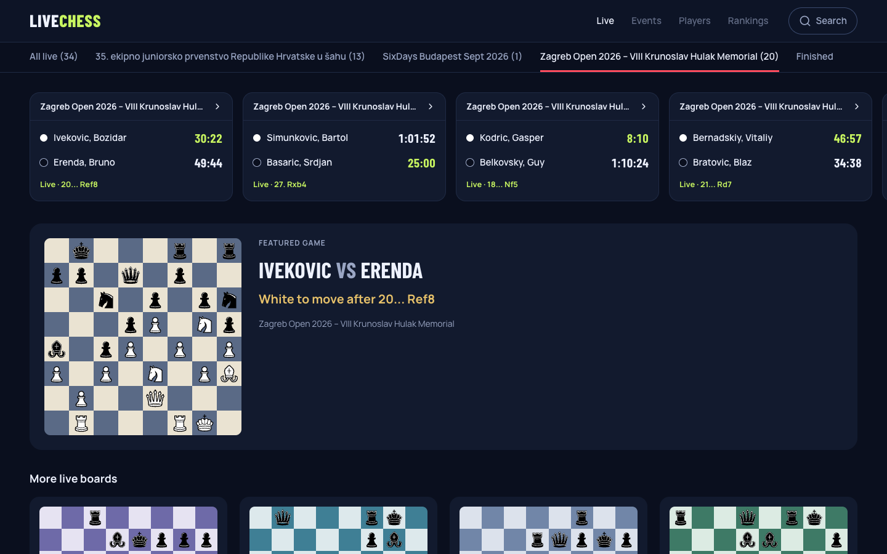
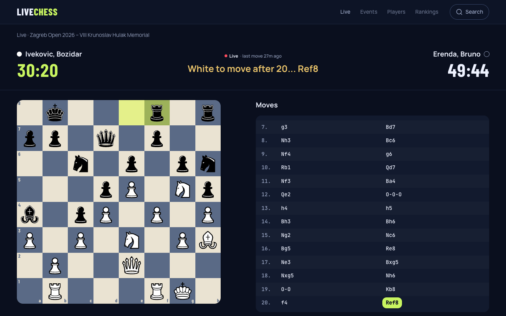
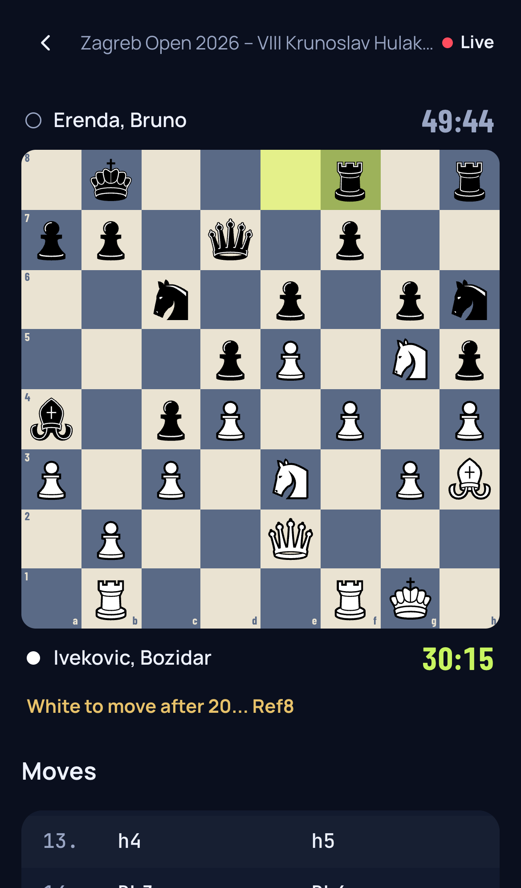
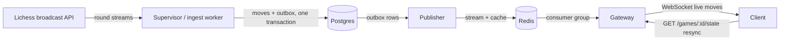

# LiveChess

[](https://github.com/AbhishekBalija/LiveChess/actions/workflows/ci.yml)
[](LICENSE)

**Every live chess game in one place, from grassroots opens to the Olympiad.**
Real-time boards with ticking clocks, pulled automatically from Lichess
broadcasts. "CREX, but for chess."

<p align="center">
  
</p>

<p align="center">
  
  
</p>

## Features

- **Live boards, no refresh**: moves arrive over WebSocket seconds after they are played, and pieces slide into place.
- **Ticking clocks**: the side to move's clock runs between moves, from each player's real `%clk`.
- **Follows Lichess by itself**: a supervisor picks up every live broadcast round, streams it, and stores every result when it ends.
- **Engine eval**: every move is analyzed by Stockfish on the server (endgames with 7 pieces or fewer come exact from the Lichess tablebase), and the current eval is pushed live to the board.
- **Starting soon**: upcoming rounds with local start times and countdowns.
- **Built for patchy mobile data**: resync by version after any gap, reconnect with backoff, takebacks and corrections handled.
- **Each game its own board**: six board palettes, picked per game so a page of boards never looks the same.

## How it works



Postgres is the source of truth; every move is versioned, and the client
recovers from any gap by resyncing from its last version. Design decisions
are recorded in [`docs/adr/`](docs/adr), the domain language in
[`CONTEXT.md`](CONTEXT.md), and the plan in [`docs/roadmap.md`](docs/roadmap.md).

## Tech stack

- **Server**: Bun, TypeScript (strict), Postgres with Drizzle ORM, Redis Streams, zod, Vitest
- **Client**: React, Vite, Tailwind CSS v4, shadcn/ui conventions, lucide-react
- **Data**: Lichess broadcast API (free; a `study:read` token is recommended)
- **CI**: GitHub Actions with Postgres and Redis service containers

## Run locally

Prereqs: Bun, Postgres, Redis. Optional: [Stockfish](https://stockfishchess.org)
for engine eval (`brew install stockfish` or `apt install stockfish`); without
it everything else still runs.

```sh
cp server/.env.example server/.env   # edit only if your Postgres differs
cd server && bun install && cd ..
cd client && bun install && cd ..
```

One-time database setup (from `server/`):

```sh
bun run migrate   # apply drizzle migrations to DATABASE_URL
bun run seed      # upsert the 3 games shown on the home page
```

Then one command from the repo root starts everything (Ctrl+C stops all of it):

```sh
bun run dev              # gateway + publisher + client + supervisor (follows live Lichess broadcasts)
bun run dev <roundId>    # follow one Lichess broadcast round instead of the supervisor
bun run dev --no-ingest  # gateway + publisher + client only
```

When Stockfish is installed, `bun run dev` also starts the eval worker
(`bun run eval` in `server/`, ADR 0006). It analyzes each game's newest
move first, then fills in older ones; `EVAL_NODES` sets how hard it
searches each position. Stockfish is GPL-3.0 and runs as a separate
program; it is not part of this repository.

The supervisor reads Lichess's active broadcasts every 5 minutes and
follows up to 8 ongoing rounds (`SUPERVISOR_MAX_ROUNDS`), streaming 2 of
them (8 with a `LICHESS_TOKEN`) and polling the rest one request at a time.
When a round ends or leaves the live list it gets one final pull so every
result is stored; on startup, rounds left with unfinished games get the
same pull. Open http://localhost:5173.

### Lichess token (free, recommended)

Lichess asks for a token on every broadcast endpoint; without one they are
heavily rate-limited and may stop working. Create one (logged in) at
https://lichess.org/account/oauth/token/create?scopes[]=study:read&description=LiveChess
(only the "Read private studies and broadcasts" permission), then add it to
`server/.env`:

```sh
LICHESS_TOKEN=lip_...
```

On startup the supervisor and ingest worker log `using Lichess token of
<your account>`, or fail with a clear message if Lichess rejects it.

To watch the simulator instead of a real broadcast, run it in a second
terminal:

```sh
cd server && bun run sim 123e4567-e89b-12d3-a456-426614174000 [--correct]
```

Each service can still be started on its own (`bun run gateway`,
`bun run publisher`, `bun run eval`, `bun run ingest <roundId>` in `server/`, `bun run dev`
in `client/`).

Open http://localhost:5173, pick a game, and watch a ply land every 2s.
`--correct` re-sends ply 4 with a different SAN once after ply 6 to show
a correction; the scripted line then ends once later moves stop fitting
the corrected position (expected). Re-running `sim` on a finished game
just reports it complete.

## Real broadcast ingestion

Instead of the simulator, point the worker at a Lichess broadcast round
(round id from lichess.org/broadcast, 8 chars):

```sh
cd server && bun run ingest <broadcastRoundId>          # streams the round (default)
cd server && bun run ingest <broadcastRoundId> --poll   # fallback: polls every INGEST_INTERVAL_MS (default 3000)
```

The worker holds the Lichess round stream open, so moves arrive within a
few seconds of Lichess. It reconnects on its own (every reconnect replays
all games, and re-ingesting is a no-op), and it exits once every game has
a result. Anonymous access allows 2 streams per IP; set `LICHESS_TOKEN`
in `server/.env` for more.

The worker upserts the tournament plus games and runs every ply through
the Move Handler; restarts continue Version from Postgres. Live games
show up on the home page at http://localhost:5173.

## Contributing

Issues and pull requests are welcome. See [CONTRIBUTING.md](CONTRIBUTING.md)
for setup and the workflow, and [SECURITY.md](SECURITY.md) to report a
vulnerability.

## License

[Apache License 2.0](LICENSE). Includes the Chessnut piece set by Alexis
Luengas (Apache-2.0); see [NOTICE](NOTICE). Game data comes from the
[Lichess API](https://lichess.org/api); LiveChess is not affiliated with Lichess.
