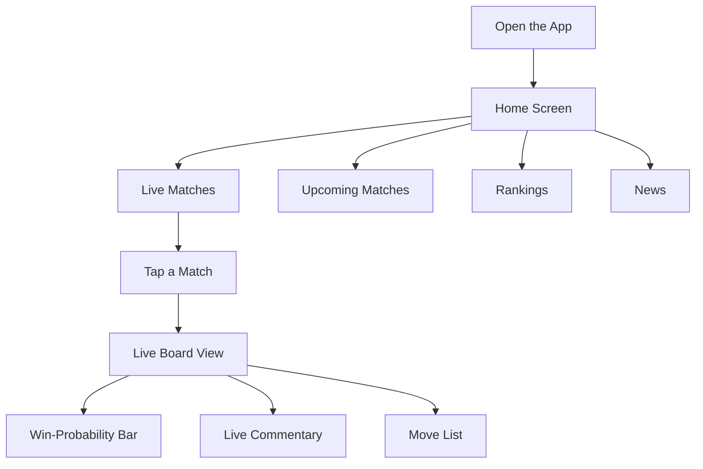
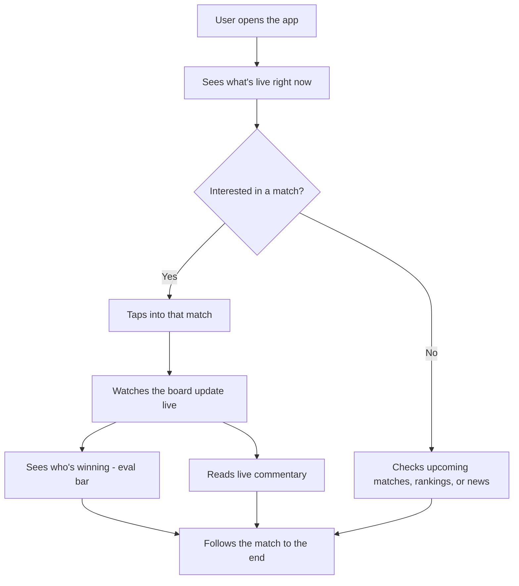
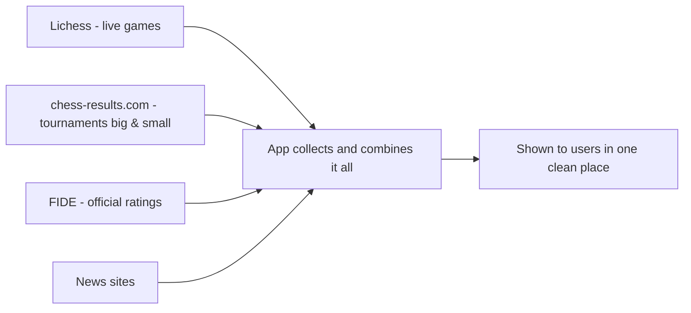
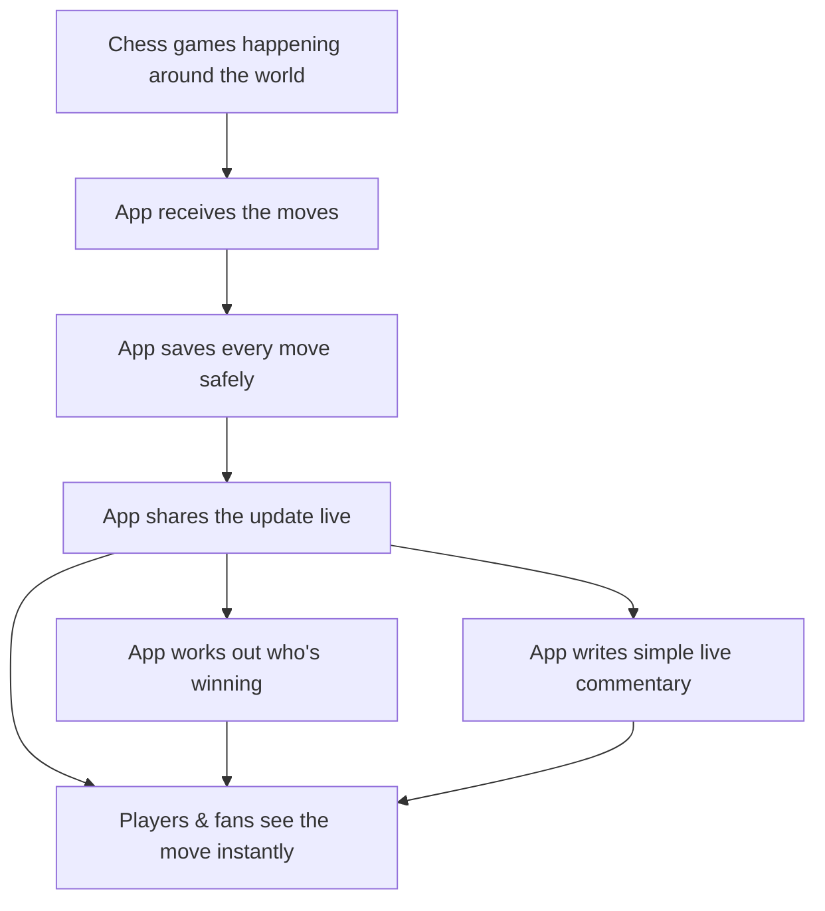
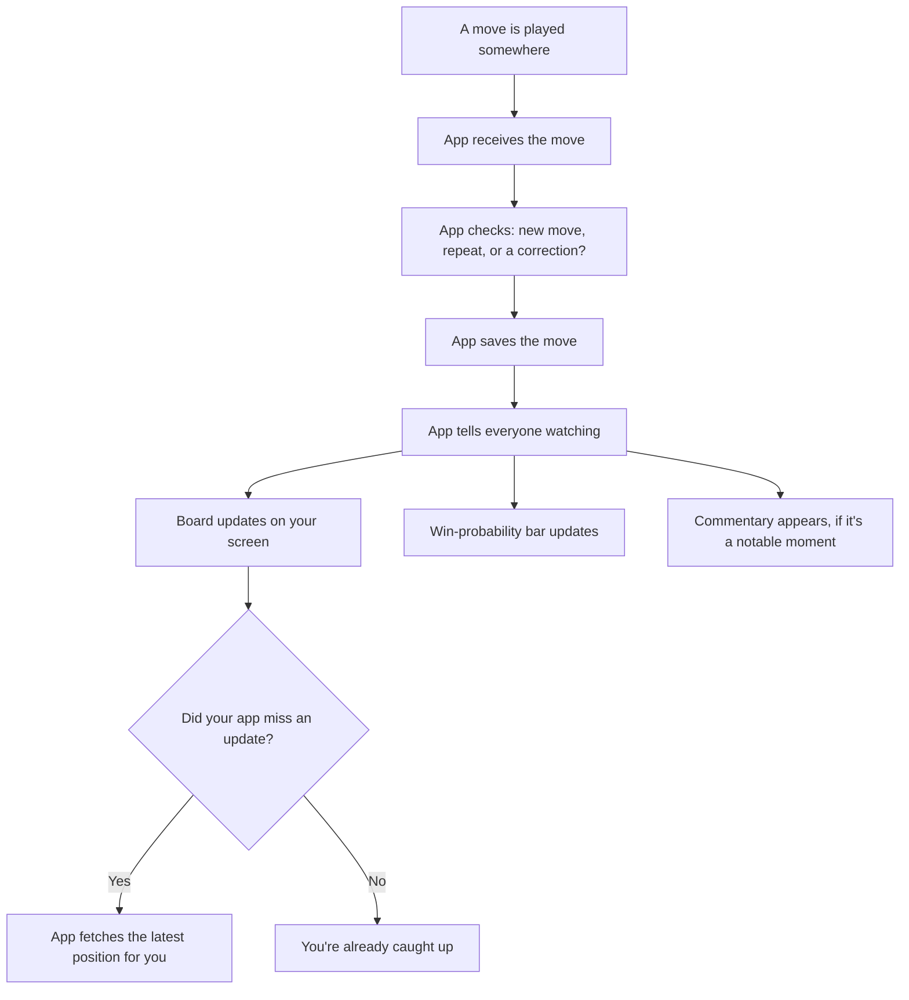
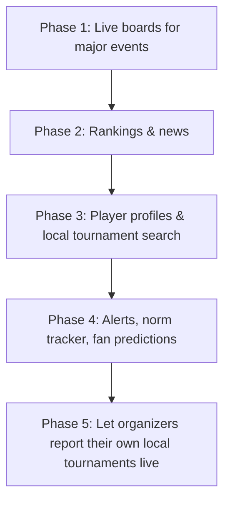

# Live Chess App — High-Level Flowcharts

*Plain-language overview diagrams covering the whole project — what the app does, how people use it, where the data comes from, how it works under the hood, and where it's headed. For deep technical detail, see the Technical Architecture Spec.*

*These are the original target diagrams, drawn before implementation
started. Live boards and clocks are built; the win-probability bar,
commentary, rankings and news in diagrams 1-2 and 4-5 are not built yet.
Diagram 6 is the original high-level phasing; for the current, detailed
Slice-by-Slice plan and delivery status see `docs/roadmap.md`.*

---

## 1. How the App is Organized

---

## 2. How Someone Uses the App

---

## 3. Where the App Gets Its Data

---

## 4. How the App Works, Simply Put

---

## 5. What Happens When One Move is Played

---

## 6. Project Roadmap

