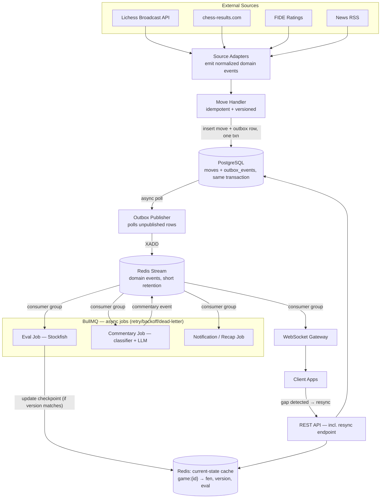

# Live Chess App — Technical Architecture Spec (v4)

*Engineering reference. See the companion Product Overview doc for the non-technical version.*

*This is the target design written before implementation started. The
outbox, versioning and resync pattern in Sections 2-4 is built (Slice 1,
see `docs/adr/`); the eval, commentary and notification queues in Sections
1 and 5 are not built yet (see `docs/roadmap.md` for what has actually
shipped, Slice by Slice).*

---

## 1. System Architecture



---

## 2. Core Invariants

1. Ingestion never waits on eval or AI.
2. A move is durable in Postgres (with its outbox row, same transaction) before it is ever considered "published."
3. A Redis failure stalls live delivery but never loses game history, and never loses an unpublished event either — the outbox guarantees eventual publication.
4. A client always recovers from a missed event via the resync endpoint, never by guessing.
5. Duplicate events are idempotent; corrections are a distinct, versioned event type.
6. Any job (eval, in particular) is discarded if the game's version has moved on since the job was created.
7. A new tournament source is a new adapter, not a core-logic change.
8. One source failing doesn't affect any other source's live games.
9. Commentary is rate-limited and classifier-gated — it can never become the most expensive or noisiest part of the system.

---

## 3. Move Identity, Versioning & the Outbox Pattern

**Identity key:** `(game_id, ply, source)`. Built as `move_number`
originally, then changed to `ply` before implementation (ADR 0001):
full-move count alone collides White and Black at the same number,
turning every Black move into a false correction.

**Duplicate vs. correction vs. truncation:**
```
same key + same notation      → duplicate, no-op
same key + different notation → correction:
                                   Game.version += 1
                                   emit GameCorrected
                                   old move row marked superseded, not deleted
different SAN at ply N, later plies exist → truncation to N (ADR 0004):
                                   every live ply after N marked superseded
                                   Game checkpoint rewinds to N
                                   Game.version += 1, emit GameTruncated
                                   then the correction/insert path above runs
                                   for ply N and any new plies after it
```

**Versioned jobs (solves both backpressure and the correction race):**
```
job.version = Game.version at job creation
...worker completes...
if job.version != current Game.version:
    discard result  # stale — either overtaken by a newer move or a correction
```
This is the same mechanism for two different problems: an eval worker falling behind real-time, and a correction arriving mid-evaluation. Both are just "the version moved on."

**Outbox pattern (resolves the Postgres → Redis dual-write gap):**
```
BEGIN
  INSERT INTO moves (...)
  INSERT INTO outbox_events (event_type, payload, published=false)
COMMIT
-- if the process crashes here, the outbox row is still there --

Outbox Publisher (separate process, polls continuously):
  SELECT * FROM outbox_events WHERE published = false
  XADD to Redis Stream
  UPDATE outbox_events SET published = true
```
Because the outbox row is written in the *same transaction* as the move, a crash between commit and publish can never lose the event — it's durable and waiting for the next poll, whenever the publisher comes back.

**Canonical data rule:** the `moves` table is canonical. `Game.current_fen` / `Game.version` is a derived checkpoint written alongside each move for cheap reads. If the checkpoint and move history ever disagree, move history wins and the checkpoint is rebuilt from it.

---

## 4. Resource Responsibility Table

| Mechanism | Purpose | Durable? | Rebuildable from? |
|---|---|---|---|
| PostgreSQL (`moves`, `outbox_events`) | Canonical move history + guarantees eventual publish | Yes | — |
| Redis current-state cache | Fast-read snapshot per game | No | Postgres checkpoint |
| Redis Stream | Live event distribution, short retention | Limited | Postgres + outbox replay |
| BullMQ (Redis-backed queue) | Async job processing — retry/backoff/dead-letter | Operational | Jobs recreated from domain events |

---

## 5. Commentary — Classifier + Cost Control

**Stage 1 — deterministic classifier** (runs before any LLM call, not eval-delta alone):
flags blunders, tactical shots, material swings relative to game phase, forced sequences, promotions, check patterns, major evaluation reversals.

**Stage 2 — rate limit:**
```
minimum interval since last commentary event for this game (e.g. every 3 moves or 20s, whichever is longer)
UNLESS classifier flags a "critical" event (blunder, mate-in-N appearing) → overrides throttle
hard cap on total commentary events per game, regardless of triggers
```
This keeps the LLM as a bounded cost, not a per-move expense.

---

## 6. Known Failure Behavior (v1 scope, stated honestly)

| Scenario | Behavior |
|---|---|
| Source connection drops | Adapter reconciles against last known state on reconnect, emits only the delta |
| Duplicate move | No-op via idempotency key |
| Correction arrives | New `GameCorrected` event, version bump, stale in-flight jobs discarded |
| Redis dies | Postgres intact; cache rebuilds from checkpoint; **no event lost** — outbox guarantees eventual publish |
| WebSocket server crashes | Stateless — client reconnects + resyncs |
| Client misses events | Resync endpoint, not local guessing |
| Eval worker falls behind | Stale jobs (version mismatch) discarded |
| Eval worker crashes | BullMQ retry/backoff; board shows last-known eval meanwhile |
| LLM down or slow | Commentary job retries/circuit-breaks off the async queue; live path unaffected |
| **Postgres unavailable** | **Not hardened in v1** — ingestion buffers upstream with retry; live delivery stalls. Known, deferred gap. |
| chess-results.com HTML changes | Isolated to its own adapter |
| Two workers process same event | Idempotency key handles it — same as duplicate case |
| **Sudden large spike in concurrent boards** | **Deferred past v1** — eval workers scale horizontally off the queue when needed |

---

## 7. Event Flow Examples

1. **Normal move** — adapter emits event → move + outbox row committed together → publisher XADDs → WS clients + eval job triggered.
2. **Duplicate move** — identity key + notation match → dropped, nothing published.
3. **Missed Redis publish** (crash between commit and XADD) — outbox row stays unpublished → picked up on next poll, no data lost.
4. **Redis restart** — current-state cache rebuilt lazily from Postgres checkpoint; stream resumes from wherever the outbox publisher left off.
5. **Client reconnect** — sequence gap detected → resync endpoint called → authoritative state + version returned.
6. **Stale eval result** — job's captured version ≠ current `Game.version` → result discarded.
7. **LLM failure** — commentary job retries via BullMQ backoff; after max retries, dropped; live path unaffected.
8. **Game correction** — notation mismatch on same identity key → `GameCorrected`, version bump → in-flight jobs on the old version discarded (same mechanism as #6).
9. **Two ingestion workers, same event** — unique constraint on identity key rejects the second insert — same handling as duplicate.
10. **Source reconnect** — adapter reconciles current source state vs. last known, emits only the delta as new domain events — no assumption of a source-provided resume feature.

---

## 8. Data Sources — Integration Notes

| Source | Access | Adapter notes |
|---|---|---|
| Lichess Broadcast API | REST + streaming, documented | Build the whole pipeline against this first |
| chess-results.com | No public API | Isolated behind its own adapter; scrape vs. partnership is a phase-2 decision, doesn't block v1 |
| FIDE ratings | Periodic downloadable list | Scheduled sync job, no live need |
| News RSS | Standard RSS | Supplement with own auto-generated recaps |

---

## 9. Feature → Architecture Mapping

| Feature | Lives in |
|---|---|
| Live win-probability bar | Eval job → current-state cache → WebSocket |
| AI live commentary | Commentary job, classifier + rate-limit gated |
| Upset alerts | Notification job (rating diff + result) |
| Title-norm tracker | API layer, from live standings + rating |
| Player profiles | Postgres (ratings + results) |
| Local tournament finder | Postgres via ChessResultsAdapter |
| "Report this tournament live" | New `OrganizerFeed`/`ManualPGN` adapter, same pipeline |
| Fan polls/predictions | Simple API + Postgres |

---

## 10. Suggested Build Order

1. Adapter interface (normalized domain events, versioned) + Lichess ingestion + outbox pattern + live board view.
2. Eval job (bar) + commentary job (classifier + rate limit).
3. Rankings + News.
4. Player profiles + local tournament finder — decide chess-results.com scrape vs. partnership here.
5. Upset alerts, title-norm tracker, polls.
6. Reliability pass on remaining gaps: Postgres-unavailable buffering, load testing for spikes.
7. `OrganizerFeed` adapter ("report this tournament live") once there are real users.
8. Revisit ingestion language (Go) only if Node ingestion demonstrably becomes the bottleneck.
