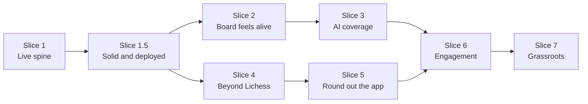

# LiveChess Roadmap

This is the build plan. It turns the product roadmap in
`live-chess-app-product-overview.md` (section 6) into slices, each one a
GitHub milestone. A slice is a thin, end-to-end piece that is demoable on
its own. Issues are filed per slice when the slice starts, not all up
front.

Terms follow `CONTEXT.md` (Ply, Version, Correction). Architecture
decisions live in `docs/adr/`.

## Order and why

- Hardening and deployment come right after the spine, so real people can
  use it early and every later slice ships to a live URL.
- Clocks and eval come before commentary, because commentary needs eval to
  know what a blunder is.
- Multi-source waits until the single-source experience is good, and it
  starts with an ADR, because the hard part is duplicate games, not fetching.
- Engagement features (alerts, polls) need accounts and notifications, so
  they come after the app has enough content to be worth returning to.

## Slice 1: Live spine (done)

Lichess broadcast ingestion, outbox, publisher, WebSocket gateway, resync,
live board. Parent issue #1, closed.

- [x] Schema, adapter, Move Handler, outbox publisher, gateway, resync
- [x] Client scaffold and live board wiring
- [x] Lichess ingestion worker (Version loaded from Postgres)
- [x] Home live strip from real data (games list endpoint, #14)
- [x] Walkthrough on a live round, close #1 (verified against the 46th
      FIDE Chess Olympiad, 0.1.0)

## Slice 1.5: Solid and deployed

Nothing new for fans; make what exists trustworthy and public.

- [x] CI on every PR (typecheck, lint, test) and CHANGELOG.md (#16)
- [x] Takebacks: correction at ply N supersedes later plies (#12, ADR 0004)
- [x] Streaming ingestion (Lichess round stream) instead of 3s polling (#20)
- [x] Design foundation: Matchday design system, redesigned home and board
      pages, clocks delivered early alongside it (#19)
- [x] Stale-feed indicator: board page shows "Live · last move Xm ago", so
      the Live dot cannot lie when the publisher or ingest is down
- [x] Fix the flaky publisher integration test (shared DB and stream)
- [x] One command to run everything locally: `bun run dev` (#17)
- [x] Broadcast supervisor: follows live Lichess rounds on its own instead
      of starting them by hand (#28, ADR 0005)
- [x] "Starting soon": upcoming rounds within a week (`GET /upcoming`),
      pulled forward from Slice 4 since the supervisor's broadcast list
      already had the data (PR #30)
- [ ] Deploy: hosted Postgres and Redis, the four server processes, the
      client, environment files per stage, basic error tracking (#18,
      blocked on host decisions, `needs-info`)
- [ ] Hardening backlog from the post-Slice-1.5 code scan, filed as
      separate issues rather than blocking: gateway fan-out is
      O(connections) per event (#32). Outbox and stream retention (#33)
      and the WebSocket heartbeat (#34) are done. Settings validation, WebSocket frame
      parsing, illegal-move handling and an outbox index are in PR #35.

## Slice 2: The board feels alive

- [x] Clocks: show remaining time per side, ticking locally for the side
      to move (delivered early with the Slice 1.5 design foundation, #19)
- [x] Results and finished games: result line on cards and the home
      Finished tab (#19); board page game-over state (Finished badge,
      winner and score, clocks stopped), pushed live by a `GameResult`
      event when the source's Result changes
- [x] Eval: server Stockfish worker plus the Lichess tablebase, latest ply
      first then backfill, stored per move and pushed live, with the
      current eval shown on the board page (ADR 0006, research in
      `docs/research/eval-options.md`)
- [x] Win-probability bar from eval: under the board and on home match
      cards, as in the Matchday design
- [x] Multi-board grid: every live board of a tournament at once
      (`/events/:tournamentId`, "Watch all N boards" on its home tab)

## Slice 3: AI coverage

- Move classifier from eval swings (blunder, mistake, tactical shot,
  material swing, forced sequence)
- AI commentary: short plain-language lines for classified moments, LLM
  with per-game and global rate limits and cost caps
- Auto recap when a game finishes

## Slice 4: Coverage beyond Lichess

- New ADR: cross-source game identity (match by event, round, board,
  players; one primary source per game writes moves; others linked in a
  `game_sources` table as fallback). Numbered when written, next after the
  highest number in `docs/adr/` at the time.
- Generic PGN URL adapter (organizer live.pgn files)
- DGT LiveChess Cloud adapter (unofficial feed, isolated behind its adapter)
- Tournament pages: rounds, pairings, standings

## Slice 5: Round out the app

- Players table and profiles
- FIDE ratings from the official monthly download
- News feed plus auto recaps from Slice 3

## Slice 6: Engagement

- Accounts (needed for anything personal)
- Follow players and tournaments, notifications
- Upset alerts, title-norm tracker
- Fan predictions and polls per round

## Slice 7: Grassroots

- "Report this tournament live" tool for organizers and arbiters
- chess-results.com adapter (pairings and results; scrape vs partnership
  decision first)
- Local tournament finder (city, rating category, entry fee)

## Known deferred items

Carried from the architecture spec, not scheduled until they are a real
problem: Postgres-unavailable buffering, large concurrent-board spikes and
load testing, Go rewrite of ingestion.
